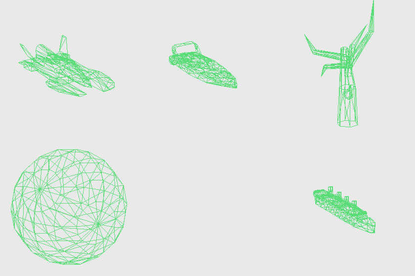

# HydroThunderTool

Reverse-engineering toolkit for **Hydro Thunder (PC, Midway/Eurocom 2000)** — a
single pure-stdlib Python script that unpacks and decodes the game's `Hydro.fsd`
asset archive.

## What works

- **FSD container + EDL1 codec** — full extraction of all 542 files
  (Huffman+LZ decompressor, verified byte-identical on all 13,572 blocks)
- **Filenames** — 536/542 original paths recovered from `HYDRO.EXE` (`names.json`)
- **Textures** — all EGF UI textures, all 1,496 `T*` world textures, and all
  1,155 `M*` mipmapped track-surface textures → PNG (the `fmt` field is the
  3dfx Glide `GrTextureFormat_t` enum)
- **Loading screens** — all 39 (`B*` records, ARGB1555)
- **3D models** — all 1,741 `G*` records → OBJ **with materials**: UVs,
  surface groups, and `.mtl` texture bindings recovered from the container's
  relocation trailers (format reversed from the exe's draw code)
- **Boat physics** — `P*` parameter records → readable text (mass, drag,
  buoyancy, handling for all 13 boats)
- **Audio** - all 459 ESF sounds + music -> 16-bit WAV (IMA ADPCM)
- **Animations & cameras** - A* keyframes -> JSON, D* demo camera scripts -> text
- **Modding** - one command, `hydrotool.py mod`, rebuilds `Hydro.fsd` from a
  single mods folder containing any mix of edited textures, models, and
  other files (byte-identical round-trip when the folder is empty).
  `hydrotool.py retexture` re-encodes an edited PNG back into a T*/M*/B*/EGF
  texture record for that folder.
- **Blender add-on** - [hydro_blender.py](hydro_blender.py): import models
  (textured, per-sub-part), whole tracks (world mesh + every prop placed),
  and animations (keyframed sub-parts); **Export & Add to Mods** writes an
  edited model straight into the mods folder with no filename to type

## Modding quick start

```
# 1. edit a texture PNG (in _textures/), then re-encode it:
python hydrotool.py retexture out/bc0abcfa.bin_split/TBBBANS_A10.bin \
    out/bc0abcfa.bin_split/_textures/TBBBANS_A10.png
# -> out/bc0abcfa.bin_split/_mods/TBBBANS_A10.bin

# 2. (optional) edit a model in Blender, click "Export & Add to Mods"
#    -> writes into the SAME _mods/ folder automatically

# 3. one command rebuilds the whole game with everything in _mods/ applied:
python hydrotool.py mod Hydro.fsd out/bc0abcfa.bin_split/_mods -o Hydro_modded.fsd
```

## Usage

Put `Hydro.fsd` from your game install next to the script, then:

```
python hydrotool.py all Hydro.fsd -o out   # everything: extract, textures,
                                           # world split, models, params
```

Outputs land in `out/bc0abcfa.bin_split/`: `_textures/`, `_screens/`,
`_models/` (OBJ+MTL, open in Blender), `_params/`. Individual steps are also
available as subcommands (`extract`, `textures`, `world`, `models`, `params`) —
see `python hydrotool.py --help`.

No dependencies. Game data is **not** included in this repo — bring your own copy.

## Docs

- [FSD_format.md](FSD_format.md) — complete file-format documentation
  (container, codec, hashing, every decoded record type, exe function addresses)
- [NEXT_STEPS.md](NEXT_STEPS.md) — project state, remaining problems
  (H* collision data, A* animations, D* camera scripts, track assembly),
  and ruled-out dead ends


